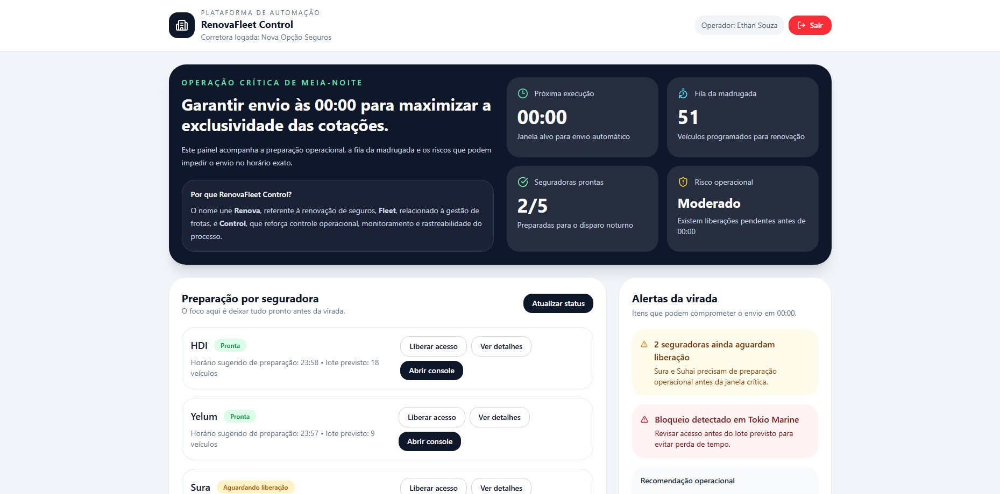
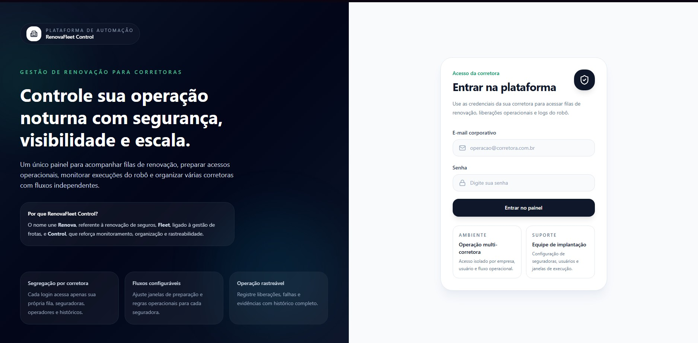

# 🚀 RenovaFleet Control

Plataforma de automação para renovação de seguros de frotas, com execução crítica às 00:00, garantindo exclusividade nas cotações e eficiência operacional.

---

## 💡 Problema

No mercado de seguros, atrasos no envio de cotações podem resultar na perda de exclusividade junto às seguradoras.

---

## 🎯 Solução

O RenovaFleet Control automatiza e monitora todo o processo de renovação, garantindo:

- Execução no horário crítico (00:00)
- Monitoramento operacional em tempo real
- Gestão de pendências (críticas)
- Rastreabilidade completa
- Registro de comunicação com clientes (E-mail e WhatsApp)

---

## ⚙️ Funcionalidades

- Dashboard operacional da madrugada
- Monitoramento de execuções críticas
- Gestão de críticas por prioridade
- Registro de comunicação com cliente
- Exportação de relatórios

---

## 🖥️ Interface

### Dashboard

### Tela de Login

---

## 📊 Tecnologias utilizadas

- React.js
- JavaScript
- Vite
- Tailwind CSS

---

## 🚧 Em desenvolvimento

- Integração com Supabase
- Automação completa do robô
- Histórico e auditoria operacional

---

## 👨‍💻 Autor

Projeto idealizado e desenvolvido por **Ethan Souza**

🔗 LinkedIn: www.linkedin.com/in/ethan-souza-658164247